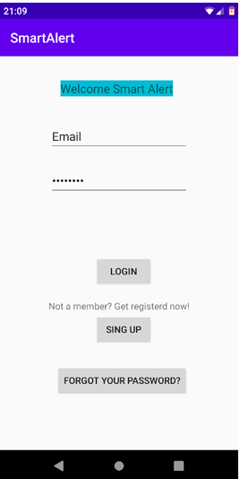
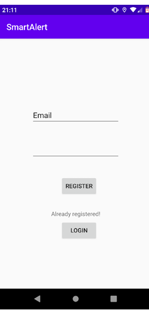
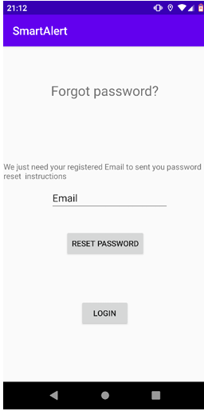
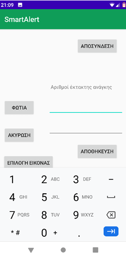
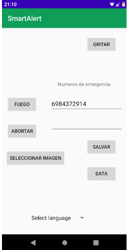
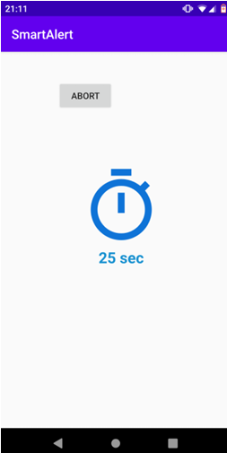
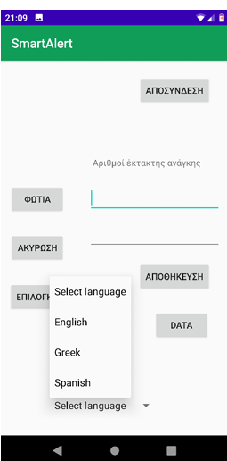

# SmartAlert 🚨

SmartAlert is a mobile application for **immediate alert in emergency situations**.  
It notifies both the user and selected contacts about possible dangers, providing **real-time information**, including the **type of emergency, geographic location, and timestamp**.

---

## Features ✨

- 📱 **User Authentication**  
  - Login / Register with email & password  
  - Password reset via email  

- 🌍 **Multilingual Support**  
  - English  
  - Greek  
  - Spanish  

- 🔥 **Fire Detection**  
  - Send emergency SMS alerts to saved contacts  
  - Upload a photo of the fire location  
  - Cancel false alerts  

- 🤕 **Fall Detection**  
  - Automatic SOS alert triggered by fall detection  
  - 30-second countdown before sending SOS  
  - SMS sent to stored emergency contacts  

- 📊 **Event History**  
  - View all recorded alerts & events  

- ☁️ **Cloud Integration (Firebase)**  
  - Store all events securely in the Firebase database  

---

## Screenshots 📸

| Login | Register | Password Reset |
|-------|----------|----------------|
|  |  |  |

| Main Menu | Fire Alert | Fall Detection |
|-----------|------------|----------------|
|  |  |  |

| Multilingual | Event History |
|--------------|---------------|
|  |

*(Replace the `docs/images/...` files with your actual screenshots.)*

---

## Tech Stack 🛠

- **Platform:** Android  
- **Backend & Database:** Firebase  
- **Programming Language:** Java 11 (required)  
- **Multilingual UI:** English, Greek, Spanish  

---

## Installation 🚀

1. Clone the repository:
   ```bash
   git clone https://github.com/dioni-theof/smart-alert.git
   cd smart-alert
